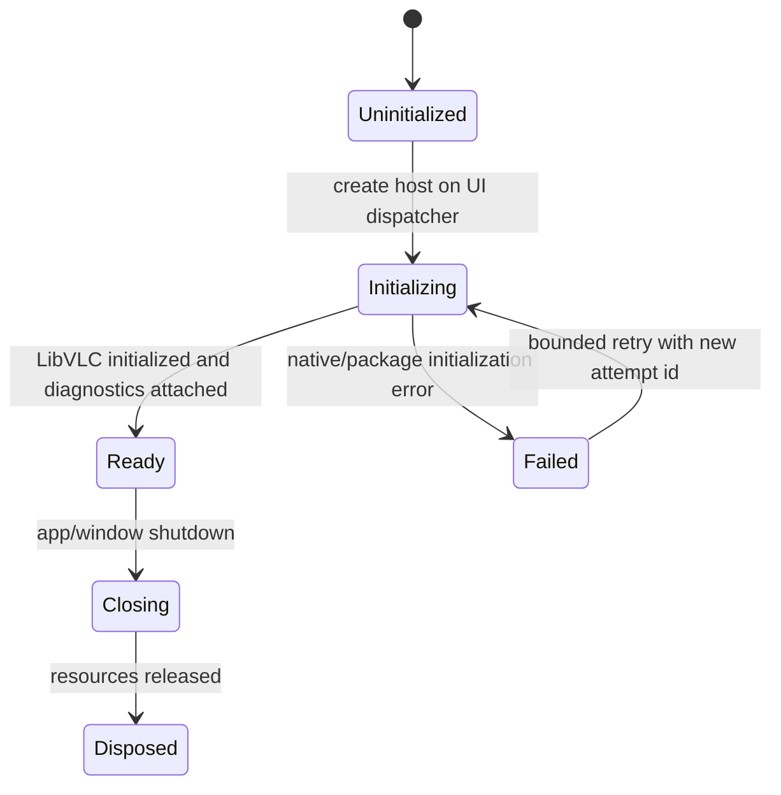
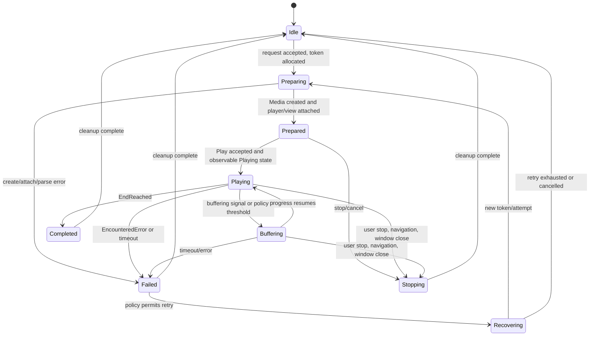

# Tvivo Constitution — Draft for Review

Status: planning document only. This document does not authorize implementation, package changes, deployment, or a claim that playback is visually proven.

Evidence labels used throughout:

- **OBSERVED** — directly measured in a run, or directly present in a source inspected on disk.
- **INFERRED** — follows logically from observed evidence, but was not itself directly measured.
- **HYPOTHESIZED** — plausible and useful as a test target, but untested.

Primary sources for this draft are the repository-root `.spike-decision-log.md`, especially the Gate 7–9 closure paragraphs; `windows-spike/WINUI3-PLAYBACK-HANDOFF-REPORT.md`; and the resolved package metadata under `D:\devcache\nuget\libvlcsharp.winui\3.10.1\lib\net10.0-windows10.0.19041\LibVLCSharp.xml`. Package metadata was inspected on disk. No throwaway API compilation was performed for this draft.

## 1. Proven facts and non-proven assumptions

### Proven facts

- **OBSERVED — Gate 9:** On the stage-4 WinUI 3 unpackaged + `LibVLCSharp.WinUI` topology, a hash-pinned, locally generated synthetic 320x240/25fps H.264/yuv420p fixture of adequate duration was played. In 15/15 completed serialized runs, the .NET `Vout` event fired and `MediaPlayer.VoutCount` reached 1. `State` remained `Playing`, `Position` advanced monotonically for the observation window, and one video track was present. The log records that the 15th unanimous result made the remaining five planned repetitions redundant under the adaptive policy; an incomplete run 16 was discarded.
- **OBSERVED — Gate 8/8b and Gate 9:** `Playing` was reached reliably on local synthetic media. Gate 8b's 1-second fixture and 10-second observation window produced no recorded `Vout`; Gate 9 changed duration to 35 seconds while keeping the media dimensions/codec/frame rate fixed and observed the output surface. The log classifies Gate 8b's null as a duration/observation-window artifact, not as a proof that output cannot be created.
- **OBSERVED — resolved API surface:** The resolved Windows package XML exposes `Media(LibVLC, string, FromType, string[])` and `Media(LibVLC, Uri, string[])` constructors; `MediaPlayer(LibVLC)` and `MediaPlayer(Media)` constructors; `MediaPlayer.Media`, `State`, `VoutCount`, `Stop()`, `Playing`, `EndReached`, `EncounteredError`, and `Vout`; and the Windows `VideoView`/`VideoViewBase.MediaPlayer` surface. The same metadata says that LibVLC may create threads and that its last-error text is thread-local.
- **OBSERVED — investigation closure:** The repro investigation is closed as of Gate 9. This closes the specific mechanism question tested by the gate; it does not turn every playback claim into a proven fact.

### Explicitly non-proven

- **HYPOTHESIZED, not proven:** `Vout`/`VoutCount=1` means that the user will see correct video pixels in the WinUI window. No screenshot, pixel comparison, or human visual check was performed.
- **HYPOTHESIZED, not proven:** The same result holds for real provider streams, non-synthetic media, other containers, other codecs, damaged inputs, long-running streams, or authentication failures.
- **HYPOTHESIZED, not proven:** All lifecycle orderings proposed in this Constitution are safe under every LibVLCSharp/WinUI teardown race. They are engineering rules to validate, not facts imported from the gate.
- **HYPOTHESIZED, not proven:** The package's Windows `VideoView` behaves identically across framework-dependent, self-contained, packaged, and unpackaged deployment modes. The investigation only establishes the stated topology and fixture scope.

**Rationale.** Gate 9 fixed an important evidentiary overreach: an event and a counter prove an engine-level output milestone, not visible pixels or provider compatibility. This boundary prevents a green diagnostic signal from being reported as a working player.

## 2. Architecture principles and deferred decisions

The architecture shall follow these principles:

1. Keep provider/authentication/catalog concerns outside the playback engine. The engine receives a normalized playback request and returns normalized state and diagnostics.
2. Keep UI controls outside the playback core. A `VideoView` is a rendering endpoint, not the owner of business policy.
3. Make every playback attempt a session with a unique generation/session token. Late events from an old attempt must not mutate the current one.
4. Make observability part of the contract: state transitions, event timestamps, stream identity, fixture identity, and terminal reason are recorded without credentials.
5. Prefer compile-time API verification and executable acceptance checks over reflection-based existence checks. Gate 9 explicitly gained confidence by compiling against `State`, `Length`, `Position`, `VoutCount`, and `Tracks`.
6. Preserve real user data and avoid destructive recovery. A playback failure is not permission to clear application state.

The following are deliberately **not decided yet**:

- The final playback backend: LibVLCSharp remains an evidence-supported candidate for the tested mechanism, but this document does not decide whether Tvivo will ship LibVLC, FFmpegInteropX, native `MediaPlayerElement`, libmpv, or another backend.
- Whether the first production slice uses one engine or an engine abstraction with a fallback. The choice depends on visual and real-media gates that have not run.
- The final supported codec/container/network matrix.
- The exact WinUI visual design system, theme-resource strategy, and packaging/deployment mode.
- Whether playback sessions are one per window, one per view, or a reusable service with view attachment.
- Reconnect policy, retry budgets, buffering thresholds, subtitle policy, track-selection policy, telemetry retention, and user-facing error copy.

Deferral is correct because the evidence does not distinguish these alternatives yet. Deciding them now would convert untested assumptions into architecture. Each deferred item must acquire a decision-changing gate before it becomes binding.

**Rationale.** The investigation repeatedly found that a plausible explanation could be disproved by a narrower gate. Deferring decisions preserves optionality while keeping the tested facts available for the smallest next slice.

## 3. Ownership and lifecycle rules

The playback engine adapter's internal ownership model is explicit and single-owner for `LibVLC`/`Media`/`MediaPlayer`; `Window`/`VideoView` remain UI-owned:

| Object | Creator | Owner | Disposal rule |
|---|---|---|---|
| `LibVLC` | Playback engine adapter | Playback engine adapter | Adapter-scoped lifetime: create once per adapter host; dispose after all adapter sessions, players, media, and view attachments have detached. |
| `Media` | Playback engine adapter | Playback engine adapter | Adapter-scoped lifetime: dispose after `Stop()` and after the adapter's player no longer references it. Never share mutable media between concurrent adapter sessions without a verified ownership plan. |
| `MediaPlayer` | Playback engine adapter | Playback engine adapter | Adapter-scoped lifetime: subscribe events before `Play`; stop first; unsubscribe handlers; detach from `VideoView`; dispose before its `Media` and before the adapter's `LibVLC`. |
| `VideoView` | WinUI window/page | The visual tree/window | Create and attach on the owning WinUI UI thread; detach the player before visual-tree disposal; dispose according to the package/control contract once no playback callback can target it. |
| Window | App/window coordinator | App shell | Window owns its view tree and dispatcher; closing initiates session shutdown and waits for bounded completion without blocking the UI thread. |
| Playback session | Playback service | Service until terminal | Owns the session token, request, event subscriptions, state reducer, and cleanup guard. It invokes the playback engine adapter's lifecycle and is the only object allowed to complete the session; it does not co-own the adapter's `LibVLC`, `Media`, or `MediaPlayer`. |

The following is the default adapter lifecycle order for normal stop/dispose, pending validation:

```text
UI close/stop request
  -> mark session Closing and invalidate token for new UI mutations
  -> playback session invokes adapter stop: `MediaPlayer.Stop()`
  -> wait for bounded quiescence / terminal callback or timeout
  -> unsubscribe LibVLC/MediaPlayer handlers
  -> detach VideoView.MediaPlayer
  -> adapter disposes `MediaPlayer`
  -> adapter disposes `Media`
  -> dispose session
  -> when the adapter host ends: after the UI has detached/disposed its VideoView/window resources, the adapter disposes its LibVLC last
```

The exact quiescence mechanism remains to be tested. A timeout is an observable failure, not a reason to silently skip cleanup. Cleanup must be idempotent and guarded against duplicate terminal events. This default is not yet validated: any deviation requires a gate that specifically tests the disposal ordering assumption before adoption.

Default threading rule (not yet validated): creation and all WinUI object access occur on the owning WinUI dispatcher. LibVLC calls that may block or create native work are not run on the UI thread unless the verified API contract and measurement show they are harmless. Callback handlers are treated as foreign-thread callbacks until their thread identity is measured; they enqueue immutable event data to the session reducer and never touch XAML directly. Any deviation requires a gate that specifically tests the relevant threading assumption before adoption.

**Rationale.** The package metadata confirms separate native objects, player/view attachment, and native thread creation, but it does not prove a universal teardown schedule. Central ownership and reverse-order disposal make the unverified part testable and prevent view lifetime from being confused with engine lifetime.

## 4. UI/engine/service boundaries and threading

The boundaries are:

```text
WinUI page/window
  - owns visual tree, dispatcher, focus, overlays, and user intent
  - receives immutable PlaybackViewState
        |
        v
Playback service/session coordinator
  - owns session token, state reducer, lifecycle, timeout, diagnostics
  - translates provider-independent requests into engine commands
        |
        v
Playback engine adapter
  - owns LibVLC/Media/MediaPlayer and VideoView attachment contract
  - translates package events and properties into engine events
        |
        v
LibVLC native runtime
```

WinUI rules:

- XAML controls, dependency properties, visual-tree attachment, and dispatcher-bound state publication happen only on the window's `DispatcherQueue`/dispatcher thread.
- The service must not expose mutable LibVLCSharp objects to the UI. It exposes snapshots, commands, and diagnostics.
- A UI callback checks the session token before applying state, because a late old-session event is otherwise indistinguishable from a current event at the view boundary.

LibVLC rules:

- The package XML directly states that LibVLC may create threads. The XML also documents thread-local last-error state and an exit callback that can wake the application loop from another thread. Therefore callback delivery is **INFERRED** to be independent of the WinUI dispatcher unless a specific callback is measured otherwise.
- Every callback captures only event kind, session token, monotonic timestamp, and safe scalar data; it then posts to the service/reducer. It must not construct, mutate, or dispose WinUI controls.
- The reducer serializes event application. State polling is sampled by the service and associated with the same session token; it is not allowed to overwrite a newer terminal state without an explicit rule.
- Dispatcher posts are bounded and cancellation-aware. A closed window cannot accumulate unbounded callbacks.

**Rationale.** Gate 7 verified a real WinUI message pump, while the package surface documents native threading. Keeping those two execution domains explicit avoids treating a callback's apparent timing as proof of UI-thread affinity.

## 5. State machines

### Initialization



### Playback session



Acceptance is split into two independently gated criteria. **Engine Acceptance** is **OBSERVED** via Gate 9's mechanism: `Playing` + `VoutCount >= 1` + advancing `Position`. **Visual Acceptance** is a distinct, separately required screenshot/pixel inspection (or equivalent visual observation). Passing Engine Acceptance does not imply Visual Acceptance; both must be independently satisfied and independently recorded. A feature is not “done” on engine evidence alone.

**Rationale.** Gate 8 and Gate 9 showed why event timing, output creation, and visible rendering must be separate states of evidence. The diagrams make terminal cleanup and recovery explicit rather than hiding them in event handlers.

## 6. Provider variability isolation

Provider-facing code shall normalize, before playback:

- authenticated URI and request headers/options;
- stream kind and stable provider identifier;
- extension/container hint, codec metadata when known, and duration when trustworthy;
- credentials and authentication failures into redacted diagnostic categories;
- retryability, expected live/VOD semantics, and cancellation behavior.

The playback core receives a `PlaybackRequest` containing only normalized values and an opaque credential/header reference. It does not parse Xtream JSON, infer provider URL conventions, or know account hostnames. Provider adapters handle missing fields, variant extensions, redirects, HTTP status, expired credentials, malformed metadata, and provider-specific quirks. The adapter must preserve the original redacted request identity for diagnostics.

The core must be tolerant of unknown codec/container combinations: it reports unsupported media, stalls, auth failure, or transport failure as distinct outcomes where evidence permits, without provider-specific branching. Real-world compatibility is established by a fixture/stream matrix, not by assuming that a synthetic H.264 MP4 generalizes.

**Rationale.** Gate 9 tested one synthetic local file. That is valuable for core mechanics but deliberately says nothing about the variability that belongs at this boundary.

## 7. Testing and observability requirements

Every playback test records, at minimum: package/runtime identity; binary and fixture hashes; session token; start/stop timestamps; event sequence with timestamps and thread IDs; `State`; `Length`; `Position`; `VoutCount`; track count/type; terminal event; exception type/message; timeout stage; and whether visual evidence exists.

Required test layers:

- compile-time API sentinel for every package member relied upon;
- deterministic local fixture checks for construction, attachment, play, stop, and disposal;
- event-plus-counter-plus-state polling, modeled on Gate 9, rather than a single race-winning event;
- visual acceptance check with a screenshot/pixel or equivalent inspected frame before claiming rendering correctness;
- real-media/provider matrix checks, run only with explicit authorization and safe test accounts;
- negative tests for auth, timeout, malformed media, cancellation, window close, and stale-session events;
- lifecycle stress tests that never open more concurrent streams than the account permits.

Reflection is not the primary API check. Gate 9's compile-time verification was stronger than its originally planned reflection check because the compiler resolved the actual referenced assembly. Reflection may supplement runtime capability reporting but may not be the sole proof that an API exists or has the expected type.

Observability must preserve anomalies and redact URLs, usernames, passwords, tokens, and provider identifiers. It must make the distinction between “engine says output exists” and “pixels were inspected” machine-readable.

**Rationale.** The Gate 8 ambiguity disappeared only when every event was logged independently, and Gate 9 became decisive by adding counters and continuous polling. Those are test-design lessons, not optional logging polish.

## 8. Artifact identity, reproducibility, harness serialization, timeout, and association

Every run must identify:

- exact source revision or working-tree identity;
- exact package versions and resolved assembly paths;
- publish/build output identity and SHA-256 hashes;
- fixture path, generation recipe, and SHA-256 hash checked immediately before publish/run;
- topology/configuration, one-variable mutation from the preceding gate, environment snapshot, and harness version;
- process PID, start time, exit time, exit code, and run number.

Harness rules:

1. Freeze the published artifact for a gate; do not rebuild between repetitions unless the gate is specifically about building.
2. Serialize processes. Capture the PID immediately, wait with a bounded timeout, and prove `Start(N+1) >= Exit(N)` before associating results.
3. Use one result record per run. A result belongs to the PID, artifact hash, fixture hash, and session token that produced it; never aggregate by filename alone.
4. Distinguish completed, timed out, crashed, harness-lost, and deliberately discarded/incomplete runs. An incomplete run is not a failure and is not a success.
5. Set a timeout justified by the observable being awaited. On timeout, retain the partial event/state trace and terminate the process safely.
6. Change one decisive variable at a time. Record the unchanged controls explicitly.

These rules codify the successful parts of Gates 6–9: hash pinning, serialized execution, immediate PID capture, non-overlapping timing, and explicit handling of a harness polling bug.

**Rationale.** A test result without artifact identity is not reproducible evidence. The investigation found both genuine first-launch variance and a harness output-loss bug; association and serialization keep those distinct.

## 9. Evidence classification scheme

All claims in code reviews, logs, plans, and reports use exactly one label:

- **OBSERVED:** direct measurement or direct source inspection. Example: **OBSERVED (Gate 9)** — `Vout` fired and `VoutCount=1` in 15/15 completed runs. Example: **OBSERVED (package XML)** — `MediaPlayer` exposes `Stop()` and `VoutCount`.
- **INFERRED:** a conclusion that follows from observed facts but was not directly measured. Example: **INFERRED** — a callback handler should marshal to the WinUI dispatcher before touching a control because LibVLC may create threads and WinUI controls are dispatcher-bound. This is a design consequence, not a measured callback-thread trace.
- **HYPOTHESIZED:** an untested explanation or expectation. Example: **HYPOTHESIZED** — the first-launch delay may be Defender/AV scanning native DLLs; the log explicitly says this was never confirmed. Example: **HYPOTHESIZED** — a `Vout` event will correspond to visible pixels.

Rules:

- Never upgrade INFERRED or HYPOTHESIZED to OBSERVED through repetition of the same indirect signal.
- Every OBSERVED claim names the gate, source file, package artifact, or run record.
- Every HYPOTHESIZED claim has a falsifier or is explicitly marked as deferred.
- If a source is absent, say “not verified,” not “probably.”

**Rationale.** The central Gate 9 limitation is epistemic: output-surface evidence is not pixel evidence. A fixed vocabulary makes that limitation survive handoffs.

## 10. Gate design rules

Before any gate action, write the decision it can change:

```text
Question -> decisive variable -> unchanged controls -> observable -> threshold
        -> decision changed if pass/fail -> next action
```

Rules:

- One gate changes one decisive variable. If two changes are necessary, split the gate or document why the information gain cannot be separated.
- State the information-gain justification before running: “If this passes, we will do X; if it fails, we will do Y.” “It might be interesting” is insufficient.
- Define the fixture, topology, observation window, timeout, and evidence class before execution.
- Prefer the smallest experiment that distinguishes the competing explanations.
- Do not rerun a closed gate merely to make its result feel more certain unless a new decision depends on it.
- A gate may close an open question only within its measured scope.

**Rationale.** Gate 9 dropped the originally planned 1280x720 mutation to avoid a confound and changed duration alone. That is the model: isolate the variable that can actually change the decision.

## 11. Adaptive repetition policy

- **1 run:** deterministic checks, including compile-time checks, static artifact identity, and a deliberately deterministic negative test.
- **3 runs:** exploratory or observability gates where the first run may expose a measurement flaw but nondeterminism is not yet plausible.
- **5 runs:** only when nondeterminism is plausible and five runs can distinguish the competing explanations.
- **20 runs:** only with explicit written justification tied to intermittent-failure history, harness validation, or a required high-confidence stability claim. Twenty is never the default.

Repetition stops early only when the predeclared stopping rule says additional runs cannot change the decision. Stop conditions and discarded/incomplete runs are recorded. Adaptive stopping must not be used to hide an unfavorable result.

**Rationale.** Gates 7/8 used 20-run exploration, while Gate 9 stopped at 15 completed runs after unanimous decisive evidence. The policy preserves that information-gain judgment without turning “20” into ritual.

## 12. Anomaly preservation and root-cause rules

An unexplained observation is a first-class result. It must be:

- logged with artifact, PID, run number, timestamps, and the exact observation;
- classified as OBSERVED, with competing explanations separately marked HYPOTHESIZED;
- carried into the next gate's risk register;
- neither discarded as noise nor silently normalized away;
- closed only by a gate that can distinguish the explanation, or explicitly accepted as unresolved with owner and follow-up.

The Gate 7/8 first-launch cold-start anomaly—run 1 taking roughly 13–31 seconds while later runs took roughly 1–6 seconds—must remain visible. The log's AV/Defender explanation is HYPOTHESIZED, not root cause. A future fresh-publish test may flag it as expected background behavior, but must not relabel it as an app finding or delete it from the record.

**Rationale.** Treating anomalies as inconvenient noise is how a harness or environment defect becomes a false product conclusion. The investigation corrected this once; the Constitution makes the correction durable.

## 13. Claude/Codex delegation and independent review

For this Windows playback work, **Codex is the mandatory primary implementation and source-verification agent**. Codex must inspect the actual source/package surface, make the requested implementation or document changes, state evidence limits, and report what it could not verify.

**Claude is the orchestrator and skeptic.** Claude must challenge Codex's claims and recommendations, independently inspect the decisive evidence, ask what decision each result changes, and reject conclusions that exceed the evidence. Claude must not merely relay Codex's summary.

For each round:

1. The brief names absolute paths, scope, acceptance criteria, evidence budget, and forbidden files/actions.
2. Codex works only within that scope and reports OBSERVED/INFERRED/HYPOTHESIZED claims separately.
3. Claude performs an independent source check and records disagreements rather than smoothing them over.
4. No agent self-certifies a visual or deployment result without the required observable evidence.
5. `/clear` is mandatory between rounds once a round is complete or when handing over a new gate. Continuity comes from the decision log and disk re-verification, not conversational memory. If continuity appears necessary, record that concern and re-read the sources instead of skipping the clear discipline.

Neither agent commits, pushes, deploys, installs, or opens a PR without explicit owner approval. Build/test/emulator approval is separate from document approval.

**Rationale.** The decision log records a skipped `/clear` discipline and context drift from scratch paths back into the real repository. Independent challenge, absolute paths, and re-verification directly address those failures.

## 14. Design-system and WinUI-learning rules

Before using a WinUI/XAML/Composition API in production UI, verify from the actual targeted SDK/package and a minimal executable sample:

- the exact type/member namespace and target framework;
- whether it depends on `XamlControlsResources`, theme dictionaries, generated PRI resources, package identity, or a specific packaging mode;
- construction and attachment lifecycle, including whether it must run on the UI dispatcher;
- disposal/detach behavior and interaction with window close;
- DPI, resize, fullscreen, focus, keyboard/D-pad, and overlay behavior;
- behavior in the chosen unpackaged deployment topology, not just in a packaged sample;
- observable success criteria, including a visible screenshot where rendering matters.

Do not infer safety from a type name or from a successful compile. Keep a small “WinUI learning record” beside each adopted pattern: source inspected, minimal reproduction result, package/SDK versions, resource dependencies, and known failure modes.

The resource-lookup crash history makes this mandatory: `XamlControlsResources` and Fluent resource resolution produced both managed and native failure signatures in the repro, and removing an obvious resource dependency did not establish that deeper framework dependencies were gone. A local hand-rolled workaround is not accepted as a design-system decision without an executable and visual check.

**Rationale.** The investigation showed that resource dependencies can fail before application behavior is meaningfully exercised. Verification must therefore happen at construction, deployment, and visual levels.

## 15. Minimal first vertical slice after approval

The first slice shall be one local, hash-pinned synthetic media session in the existing WinUI 3 unpackaged shell, with no provider login, catalog, retry policy, or production visual polish:

1. Create one playback host and one session on the UI dispatcher.
2. Create `LibVLC`, `Media`, and `MediaPlayer` through the compile-time-verified API surface.
3. Attach one `VideoView` to a real window and subscribe to `Playing`, `Vout`, `EncounteredError`, and `EndReached` before `Play()`.
4. Play the same adequate-duration 320x240/25fps H.264 fixture used by Gate 9, verifying its SHA-256 immediately before the run.
5. Publish a minimal state model: Preparing, Playing, Failed, Completed, and Stopping.
6. Require two separate, independently gated acceptance criteria: (a) **Engine Acceptance**, **OBSERVED** via Gate 9's mechanism (`Playing` + `VoutCount >= 1` + advancing `Position`); and (b) **Visual Acceptance**, a separately required visual evidence record (one settled screenshot inspected for actual picture content). Passing Engine Acceptance does not imply Visual Acceptance; satisfy and record both independently. The slice is not done on engine evidence alone.
7. Stop by user action or window close, exercise the bounded cleanup order, and assert no stale-session event mutates the next idle state.

The slice is accepted only if it proves the complete path—window to view to engine to media to output observation to visual inspection to stop/dispose—without introducing provider assumptions. If it fails, the failure must identify the boundary and inform the backend/lifecycle decision; it must not trigger a whole-architecture rewrite before the evidence is classified.

**Rationale.** This is the smallest slice that closes Gate 9's two explicit gaps—pixels and a real UI lifecycle—while preserving the synthetic fixture's reproducibility and avoiding a premature provider integration.

## 16. Microsoft win-dev-skills as a pinned tooling layer

**OBSERVED — [Microsoft `win-dev-skills` repository at tag `v0.6.1`](https://github.com/microsoft/win-dev-skills/tree/v0.6.1), exact tree independently verified:** The tag ref points to annotated tag object `2f96610726d2c9f92e81daa58fcdc9ccbdc71bb9`, which resolves to commit `f94bab12f67f8670567c08b079dfd3179a1d15b4` (the commit governing the exact `v0.6.1` tree, not `main`). At that exact tag tree, the verified structure includes standalone `winmd-cli` and `winui-analyzer` tools under `src/tools`, and `winui-code-review`, `winui-design`, `winui-dev-workflow`, `winui-ui-testing`, `winui-packaging`, `winui-session-report`, `winui-setup`, and `winui-wpf-migration` under `plugins/winui/agent-plugin/skills/`. This is a Microsoft-maintained, MIT-licensed, actively tagged set of WinUI 3 / Windows App SDK developer-tooling agents and skills. It is external tooling, not a Tvivo-authored component.

Tvivo will evaluate and may adopt the following where useful: `winui-design`, `winui-code-review`, `winui-ui-testing`, `winui-analyzer`, `winmd-cli`, and `winui-dev-workflow`. Adoption is conditional and task-specific; it is not blanket adoption of the repository or all of its skills.

Installation and version pinning are mandatory. Any adopted tool or skill must be pinned to an exact tagged release or commit SHA, recorded in a manifest or lockfile-equivalent within the repository. Tvivo must never track a moving branch. An upgrade is a deliberate, reviewed action that includes checking the upstream changelog; it is not automatic.

Scope is limited to development-time WinUI/XAML/Composition tasks: design guidance, code-review assistance, UI-testing assistance, static analysis, WinMD inspection, and development-workflow orchestration. These tools may operate on `windows-spike` UI code only. They must never operate on the playback-engine core, provider/authentication logic, or repo-wide architecture decisions.

Every tool output—a design suggestion, code-review finding, generated test, or analyzer finding—is an unverified proposal until independently checked by the Claude/Codex process in section 13. It goes through the same OBSERVED/INFERRED/HYPOTHESIZED discipline as any other claim. Codex must perform its own independent source verification rather than accepting the tool's output at face value, and Claude must retain its mandatory skeptical review.

If a pinned version regresses, misbehaves, or a tool's suggestion causes a defect, revert to the last known-good pinned version and record the incident. Do not silently patch around a bad suggestion without recording why.

These are preview/evolving Microsoft tools that provide grounded assistance for WinUI development tasks, but they do not own architecture decisions, do not override this Constitution, do not replace Codex's mandatory implementation/source-verification role, and do not replace Claude's mandatory skeptical review.

For the section-15 first vertical slice, `winui-analyzer` may be appropriate for static checks on the new UI code, and `winui-ui-testing` may be appropriate for the visual/screenshot acceptance check required by slice step 6, subject to the independent review rule above. `winui-design`'s broader design-system work is explicitly out of scope for that slice because the slice is deliberately minimal and excludes visual polish. The other listed tools are also out of scope unless a narrowly justified slice task requires them; none may expand the slice into provider, architecture, or playback-engine work.

For the future WinUI design-learning workflow in section 14, these tools supplement but do not replace the required WinUI learning record. A tool's design suggestion still requires the source, lifecycle, dispatcher, deployment, and visual verification that section 14 mandates, with the result recorded alongside the adopted pattern.

**Rationale.** Pinning makes the evidence reproducible, scope prevents development helpers from reaching unrelated product boundaries, and non-authority rules prevent tools this new and Microsoft-preview-labeled from silently gaining architecture authority merely because they are official.

## Unresolved decisions

- Whether LibVLCSharp.WinUI is the shipping backend after visual and real-media validation.
- Whether the first production backend needs a fallback and what fallback is justified by evidence.
- Which provider/container/codec/auth matrix is a supported product contract.
- Exact `LibVLC` lifetime: application-wide versus playback-host scoped.
- Exact cross-thread quiescence and disposal primitive for `Stop()` and window close.
- Packaging/deployment mode and its resource/PRI requirements.
- Visual acceptance threshold: screenshot comparison, decoded-frame capture, or another auditable method.
- Reconnect, buffering, retry, subtitle, track-selection, and telemetry policies.
- Whether the service supports multiple simultaneous windows/sessions.
- Final WinUI design system, theme resources, Composition usage, and accessibility/focus contract.
